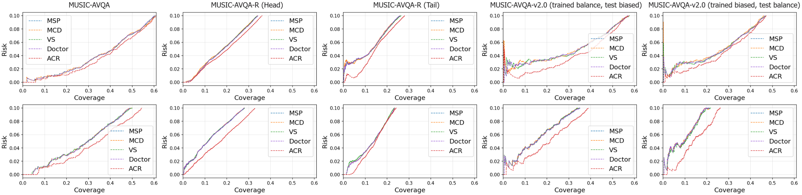
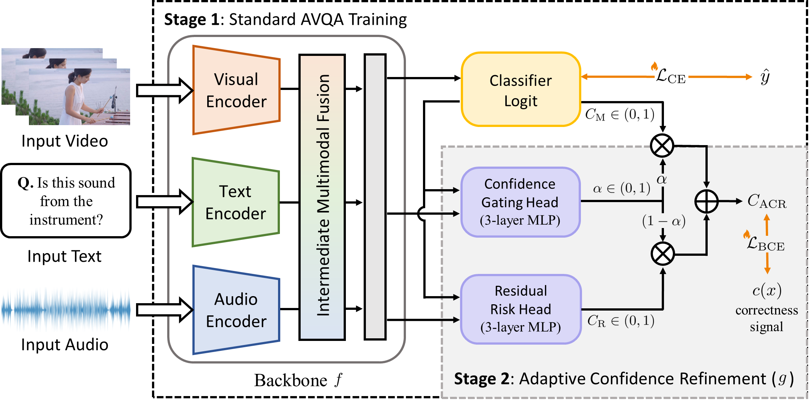
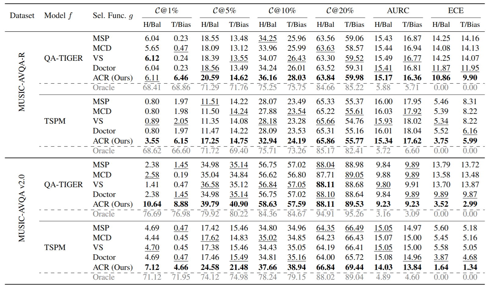
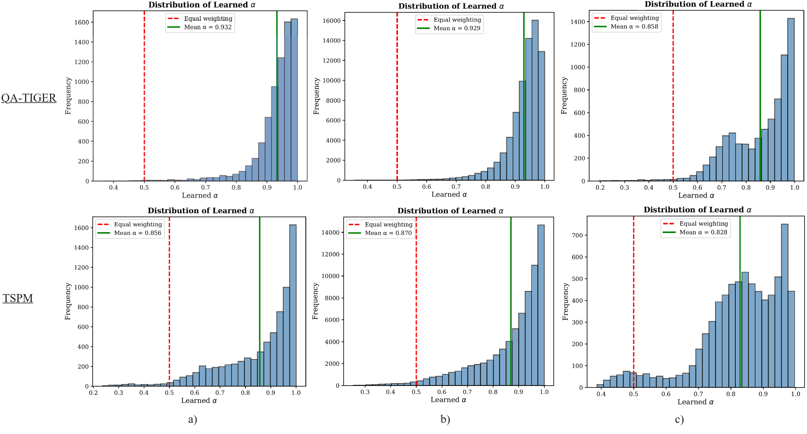
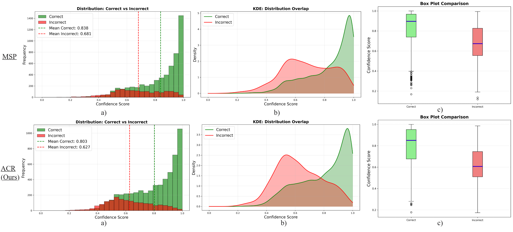
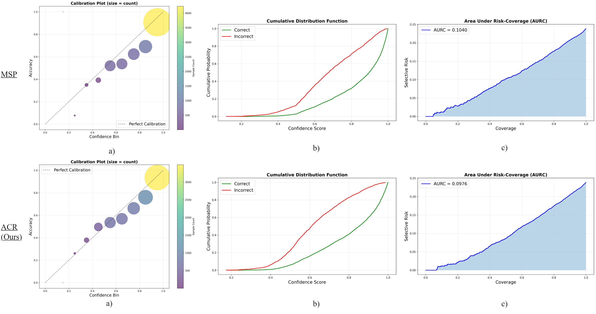

# Knowing When to Answer: Adaptive Confidence Refinement for Reliable Audio-Visual Question Answering
Official PyTorch implementation of our paper
* **Title**: [Knowing When to Answer: Adaptive Confidence Refinement for Reliable Audio-Visual Question Answering](https://github.com/PhuTran1005/R-AVQA)
* **Authors**: [Dinh Phu Tran](https://github.com/PhuTran1005), [Jihoon Jeong](https://github.com/ijihoon98), [Seongah Kim](https://github.com/kimseongah), [Thao Do](https://github.com/thaodod), [Cem Subakan](https://github.com/ycemsubakan), Daeyoung Kim
* **Institutes**: 1) School of Computing, KAIST, Republic of Korea; 2) Laval University; 3) Mila-Quebec AI Institute <br>

<p align="center">  </p>

:pushpin: *We confirm that the relevant code and implementation details will be available upon acceptance. Please be patient*😇.

**📄 Abstract**
We present a formal problem formulation for \textit{Reliable} Audio-Visual Question Answering ($\mathcal{R}$-AVQA), where we prefer abstention over answering incorrectly. 
While recent AVQA models have high accuracy, their ability to identify when they are likely wrong and their consequent abstention from answering remain underexplored areas of research. To fill this gap, we explore several approaches and then propose Adaptive Confidence Refinement (ACR), a lightweight method to further enhance the performance of $\mathcal{R}$-AVQA. Our key insight is that the Maximum Softmax Probability (MSP) is Bayes-optimal only under strong calibration, a condition usually not met in deep neural networks, particularly in multimodal models. Instead of replacing MSP, our ACR maintains it as a primary confidence signal and applies input-adaptive residual corrections when MSP is deemed unreliable. ACR introduces two learned heads: i) a Residual Risk Head that predicts low-magnitude correctness residuals that MSP does not capture, and ii) a Confidence Gating Head to determine MSP trustworthiness. Our experiments and theoretical analysis show that ACR consistently outperforms existing methods on in- and out-of-disrtibution, and data bias settings across three different AVQA architectures, establishing a solid foundation for $\mathcal{R}$-AVQA task.
<p align="center">  </p>

## Overview
**📊 Coverage at target risk ($\mathcal{C}$@$\mathcal{R}$) $\uparrow$, AURC $\downarrow$, and ECE $\downarrow$ for all selection functions on MUSIC-AVQA dataset. All values are in %.**
<p align="center">  </p>

**🖼️ Qualitative results**
<p align="center">  </p>

**📈 Distribution Analysis**
<p align="center">  </p>
<p align="center">  </p>

**📈 Calibration Quality**
<p align="center">  </p>

## Citation
Please consider citing our paper in your publications, if our findings help your research.
```bibtex
TBD
```

## Acknowledgment
We acknowledge the following contributors whose code served as the basis for our work:

[QA-TIGER](https://github.com/AIM-SKKU/QA-TIGER) and [MUSIC-AVQA](https://github.com/GeWu-Lab/MUSIC-AVQA).

## Contact
For any questions, please contact [Dinh Phu Tran](mailto:phutx2000@kaist.ac.kr).